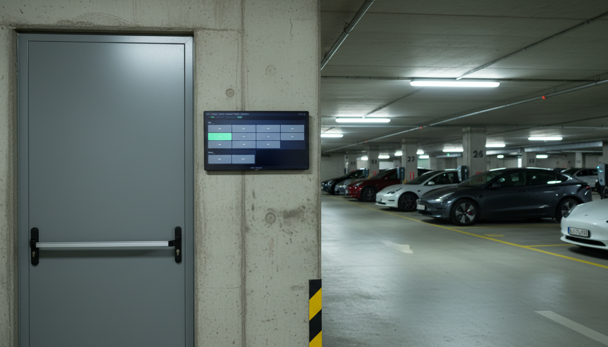

# reev Kiosk

Full-screen EV charging station monitoring kiosk, powered by the [reev API](https://docs.reev.com/). Designed for iPads and touch-screen displays at parking sites.

Built with **Next.js 16** and **Tailwind CSS**. No database required -- the reev API is the data layer.



[](https://vercel.com/new/clone?repository-url=https%3A%2F%2Fgithub.com%2Femonvia%2Freev-kiosk&env=REEV_API_URL,REEV_CLIENT_ID,REEV_CLIENT_SECRET&envDescription=reev%20API%20credentials%20required%20to%20connect%20to%20charging%20stations&envLink=https%3A%2F%2Fgithub.com%2Femonvia%2Freev-kiosk%23environment-variables&project-name=reev-kiosk)

---

## What it does

The kiosk shows a live grid of all your reev charging stations, grouped by location. Each connector is a color-coded cell that updates automatically:

| Color | Status |
| ----- | ------ |
| Green | Available |
| Blue (glowing) | Charging |
| Yellow | Occupied (idle) |
| Red | Faulted |
| Grey | Offline / Unavailable |

Stations are grouped by location and sized by connector count -- large sites get bigger cards. The grid auto-refreshes every 15 seconds.

## How to use it

### 1. Deploy

Click the **Deploy with Vercel** button above, or clone and run locally (see below). You need reev API credentials (`REEV_API_URL`, `REEV_CLIENT_ID`, `REEV_CLIENT_SECRET`).

### 2. Open on a display

Navigate to your deployed URL on any browser. The kiosk is designed for full-screen use on iPads and touch displays -- just open the URL and enable full-screen mode.

### 3. Optional: Lock with a PIN

Set the `GRID_PIN` environment variable to a 4-8 digit code. Users must enter the PIN before seeing the grid. Omit the variable for open access.

### 4. Optional: Change language

Set `KIOSK_LOCALE` to your preferred language code (default: `en`).

---

## Run Locally

```bash
# 1. Clone the repo
git clone https://github.com/emonvia/reev-kiosk.git
cd reev-kiosk

# 2. Install dependencies
npm install

# 3. Configure environment
cp .env.example .env.local
# Edit .env.local with your reev API credentials

# 4. Start dev server
npm run dev
```

Open [http://localhost:3000](http://localhost:3000) to see the kiosk.

---

## Environment Variables

| Variable             | Required | Default      | Description                                                                        |
| -------------------- | -------- | ------------ | ---------------------------------------------------------------------------------- |
| `REEV_API_URL`       | Yes      | --           | reev API base URL (e.g. `https://api.reev.com`). Auth endpoint is `{base}/auth`.   |
| `REEV_CLIENT_ID`     | Yes      | --           | OAuth2 client ID                                                                   |
| `REEV_CLIENT_SECRET` | Yes      | --           | OAuth2 client secret                                                               |
| `REEV_API_VERSION`   | No       | `2024-08-01` | API version header                                                                 |
| `GRID_PIN`           | No       | --           | 4-8 digit PIN to lock the kiosk (omit for open access)                             |
| `KIOSK_LOCALE`       | No       | `en`         | Kiosk display language                                                             |

---

## License

MIT
